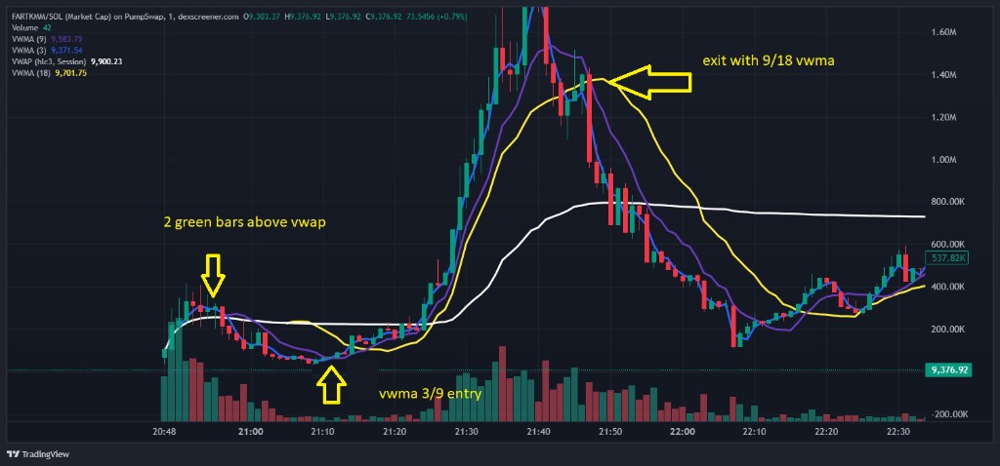
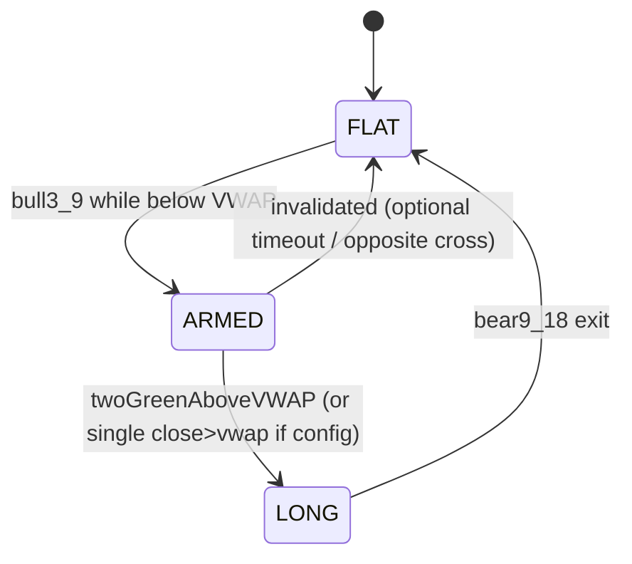

# Standalone Solana Trading POC — Staged Project Document

**Purpose:** Prove a minimal **single-coin, single-agent** trading module end-to-end: compute signals from **OHLC fetched from CoinGecko**, then **buy/sell on Solana** using **Phantom** (or a Phantom-compatible signing path).  
**Strategy (baseline):** Align with the annotated chart logic: **VWMA(3) × VWMA(9) cross while price regime is “below VWAP,” then confirmation “above VWAP” (including the “two green closes above VWAP” idea as an optional filter),** exit on **VWMA(9) bearish cross through VWMA(18)**.

**Visual reference (deep tie-in to your screenshot):**  
The chart is **FARTKMM / SOL** on **PumpSwap**, **1-minute** candles, with **VWAP (session, hlc3)** and **VWMA(3) / VWMA(9) / VWMA(18)**. Your yellow annotations mark:

| Annotation | What it marks | Engineering interpretation |
|------------|---------------|------------------------------|
| “2 green bars above vwap” | Two consecutive **bullish** closes **above** the white VWAP | Optional **confirmation filter** after the structural 3/9 cross: require **two closes > VWAP** (and optionally **close > open** on each) before arming the actual buy. |
| “vwma 3/9 entry” | The **blue × purple** interaction near the start of the pump | **Primary entry trigger:** detect **VWMA(3) crossing VWMA(9)** in the **direction you want** (typically **bullish cross** for a long), while the market is still **“below VWAP”** in a defined sense (see Stage 4). |
| “exit with 9/18 vwma” | **Purple crosses down through yellow** after the peak | **Exit rule:** when **VWMA(9)** crosses **below VWMA(18)** (bearish 9/18 cross), **close the position** (full exit for this POC). |

The price narrative in the image (market cap rising from ~**200k** toward **1.6M+**) is the **kind of impulse move** this logic is trying to catch: **enter early in the expansion**, **exit on slower-line rollover**.

> **Important honesty check (data vs chart):** Your screenshot is **1m** from an **on-chain DEX** feed. CoinGecko’s **public** OHLC endpoint does **not** give **1m** candles. For `days=1` or `2`, CoinGecko OHLC granularity is **30 minutes**; for `3–30` days it is **4 hours** (see [Coin OHLC Chart by ID](https://docs.coingecko.com/reference/coins-id-ohlc)). **Paid** plans add `interval=hourly` / `daily` in some cases.  
> **Implication:** This POC can **still prove** indicator math + wallet plumbing, but **timestamps and fills will not match** the chart bar-for-bar unless you upgrade data (Pro, or another venue feed). Stage 2 spells out how to handle this without lying to yourself in backtests.

---

## Reference image (project copy)

---

## Stage 0 — Scope, success criteria, and non-goals

### 0.1 In scope

- One **configurable** Solana SPL token (one “coin”) + one **quote** asset (typically **SOL** or **WSOL** path).
- **Signal engine** implementing:
  - **VWAP** (define session anchor; see Stage 3).
  - **VWMA(3), VWMA(9), VWMA(18)**.
  - **Entry FSM** (finite state machine) described in Stage 4.
  - **Exit** on **bearish VWMA(9)/VWMA(18)** cross while in position.
- **Data ingestion** from **CoinGecko** OHLC (required by your brief), with explicit handling of granularity limits.
- **Execution path** compatible with **Phantom** on Solana (see Stage 5 — Phantom is primarily a **user-controlled signer**; a server “agent” needs a clear signing model).

### 0.2 Out of scope (for this POC)

- Multi-pair portfolio logic, hedging, partial exits, pyramiding, TP/SL ladders.
- MEV protection, private RPC, advanced routing (unless you explicitly add a later stage).
- Guaranteeing profitability or parity with TradingView/PumpSwap 1m behavior.

### 0.3 Definition of “done”

- **Offline replay:** Given a downloaded OHLC series, the bot prints **entry/exit timestamps and reasons** that match the rules.
- **Live paper mode:** Fetches CoinGecko on a timer, emits signals, **does not send txs**.
- **Live tiny-size mode:** On a devnet/test token **or** mainnet with **dust** size, signs **one buy** and **one sell** successfully via your chosen Phantom-compatible approach.

---

## Stage 1 — Formal strategy spec (pinning down ambiguities)

### 1.1 Candle semantics

For each bar (index \(i\)) you have **O, H, L, C** and **volume V** (CoinGecko OHLC includes volume indirectly via market endpoints; if volume is missing on a candle, define behavior — Stage 2).

Use **hlc3** for VWAP anchor consistency with your chart legend when comparing to TradingView:

\[
\text{typical\_price}_i = \frac{H_i + L_i + C_i}{3}
\]

### 1.2 VWMA definition (per bar)

Volume-weighted moving average over the last `n` bars (including current):

\[
\text{VWMA}(n)_i = \frac{\sum_{k=i-n+1}^{i} C_k \cdot V_k}{\sum_{k=i-n+1}^{i} V_k}
\]

Edge case: if \(\sum V = 0\), **skip** signals for that bar or carry forward last value — pick one and log it.

### 1.3 VWAP definition (must be pinned for code)

TradingView “Session VWAP” resets at a session boundary. For the POC, choose **one** of:

- **UTC calendar day VWAP** (resets at 00:00 UTC), or  
- **Rolling VWAP** over last `N` bars (not identical to TV session VWAP, but easy to test), or  
- **Anchor VWAP** from the timestamp of bot start / pump detection.

**Document the choice in code config** so results are reproducible.

### 1.4 “Cross below VWAP / above VWAP” — two valid readings

Your annotations combine:

1. **3/9 cross “in the VWAP neighborhood”** (image arrow points at lines interacting **near** VWAP), and  
2. Textual rule: **3/9 cross happens below VWAP** then **cross above VWAP**.

Pick **one** canonical rule set for v1:

**Recommended v1 (strict, testable):**

- Let `bull3_9(i)` be true on bar `i` if **VWMA(3)** crosses **above** **VWMA(9)** on that bar (use **previous vs current** comparison to avoid intrabar ambiguity).
- **Below VWAP precondition:** On the **cross bar** `i`, require `typical_price_i < VWAP_i` **or** `C_i < VWAP_i` (choose one; `C` is stricter).
- **Above VWAP confirmation:** Require **existence** of a later bar `j > i` where `C_j > VWAP_j`, and optionally your screenshot’s **two consecutive bullish closes above VWAP**:
  - `C_{j-1} > VWAP_{j-1}` and `C_j > VWAP_j`
  - and `C_{j-1} > O_{j-1}` and `C_j > O_j` (green candles)

**Entry fire:** When confirmation completes, **open long** (single position).

**Exit:** On first bar `e` where **VWMA(9)** crosses **below** **VWMA(18)** (`bear9_18(e)`), **close long**.

### 1.5 State machine (summary diagram)

---

## Stage 2 — Data layer (CoinGecko OHLC, volume, rate limits)

### 2.1 Primary endpoint (required)

- **Endpoint:** `GET https://api.coingecko.com/api/v3/coins/{id}/ohlc`  
- **Params:** `vs_currency=usd` (or `sol` if supported for your asset), `days` in `{1,7,14,30,90,180,365,max}`  
- **Response rows:** `[ timestamp_ms, open, high, low, close ]`  
- **Timestamp note (CoinGecko):** Timestamp indicates the **end (close) time** of the candle ([docs](https://docs.coingecko.com/reference/coins-id-ohlc)).

### 2.2 Granularity reality vs your 1m chart

| `days` range (auto granularity) | Candle size (public/auto) |
|----------------------------------|---------------------------|
| 1–2 | **30 minutes** |
| 3–30 | **4 hours** |
| 31+ | **4 days** |

**POC recommendation:** Use `days=1` or `2` for **30m** bars to maximize bar count while staying on the brief. Log **effective bar duration** on every fetch.

### 2.3 Mapping “one coin” to CoinGecko `{id}`

- Resolve **`{id}`** via `/coins/list` or the coin page “API ID”.  
- For **obscure Pump.fun / PumpSwap** tokens, CoinGecko coverage may be **missing** or **laggy**. Stage a **preflight check**: if OHLC is empty, fail fast with a clear error.

### 2.4 Volume for VWMA / VWAP

CoinGecko OHLC rows **may not include per-candle volume**. If absent:

- **Option A (still “from CoinGecko”):** Pull **`/coins/{id}/market_chart`** for `total_volumes` aligned to the same range and **resample/merge** onto OHLC timestamps (more engineering work, more honest VWMA).  
- **Option B (degenerate but simple):** Set `V_i = 1` for all bars → VWMA reduces to **SMA of close**; VWAP becomes **hlc3 cumulative average**. This **does not** reproduce TradingView VWMA/VWAP semantics. If you choose this, label results **“volume-agnostic POC.”**

### 2.5 Operational constraints

- Respect **rate limits**; cache responses; exponential backoff on `429`.  
- CoinGecko updates can lag real DEX prints; **slippage** and **stale signals** are expected.

---

## Stage 3 — Indicator module (pure functions + tests)

### 3.1 Deliverables

- A small library that takes arrays `(O,H,L,C,V)` and returns aligned series: `VWAP`, `VWMA3`, `VWMA9`, `VWMA18`.  
- Unit tests with **hand-constructed** micro series to validate:
  - known SMA/VWMA on constant volume  
  - cross detection only on **closed** bars  
  - VWAP reset behavior at session boundary

### 3.2 Cross detection policy

For “cross on the close” (recommended for bots):

- Bullish `3/9`: `VWMA3_{i-1} <= VWMA9_{i-1}` and `VWMA3_i > VWMA9_i`  
- Bearish `9/18`: `VWMA9_{i-1} >= VWMA18_{i-1}` and `VWMA9_i < VWMA18_i`

Avoid **repainting**: do not use **high/low** intrabar unless you explicitly subscribe to streaming data (you are not, on CoinGecko polling).

---

## Stage 4 — Single-agent signal loop (orchestration)

### 4.1 Agent responsibilities

- **Fetch** latest OHLC window from CoinGecko.  
- **Merge** volume (if used).  
- **Compute** indicators.  
- **Advance** the FSM from Stage 1.  
- **Emit structured events** (JSON logs): `SIGNAL_ARMED`, `SIGNAL_ENTRY`, `SIGNAL_EXIT`, `NOOP`, `ERROR`.  
- **Execution adapter** call (Stage 5) when transitioning to `LONG` or exiting.

### 4.2 Scheduling

- Poll interval should be **> Coingecko cache cadence** and respectful of limits; for 30m candles, polling every **1–5 minutes** is usually enough for a POC (signals only change on **closed** bars anyway — use **clock alignment** to the reported candle close times).

### 4.3 Single-position constraint

- If an entry triggers while already long, **ignore** or **log warning** (POC: ignore).

---

## Stage 5 — Solana execution + Phantom (architecture choices)

Phantom is a **wallet app** that signs transactions presented by a **dApp** (browser) or via **wallet deep links** in mobile flows. A headless Linux “agent” **does not** embed Phantom UI. You need one of these **explicit** models:

### 5.1 Model A — “Human-in-the-loop” (closest to true Phantom)

- Small **local web dashboard** (e.g., Next.js/Vite) using **Solana Wallet Adapter** with **Phantom**.  
- The **agent** writes proposed trades to a queue; the **dashboard** requests approval; Phantom signs; txs submitted via RPC.  
- **Pros:** safest, true Phantom UX. **Cons:** not fully unattended.

### 5.2 Model B — Headless keypair (not Phantom, but common for bots)

- Store **encrypted** keypair material in OS secret storage / file permissions, load into `@solana/web3.js` **Keypair** and sign in-process.  
- **Pros:** fully automated. **Cons:** **not Phantom**; treat as **hot wallet** with strict limits.

### 5.3 Model C — Remote signer / hardware (later)

- Use a signing service or hardware wallet integrations — overkill for first POC unless you already have it.

**POC recommendation:** This repository ships **Model B** headless execution (`SOL_BOT_HEADLESS_SIGNER`) plus notify-only chart-web. For true Phantom signing, host your own **Model A** wallet-adapter UI that calls `executeJupiterSwap` with the user’s wallet.

### 5.4 Swap mechanics (where buys/sells actually happen)

Define the **exact venue** (Jupiter aggregator, Raydium, PumpSwap-compatible router, etc.). For each:

- **Quote** endpoint → obtain transaction bytes / instructions.  
- **RPC** (`mainnet-beta` or `devnet`) → simulate + send.  
- **Slippage**, **priority fees**, and **WSOL** wrapping behavior must be explicit.

### 5.5 Safety rails (non-negotiable even for a POC)

- **Max notional per trade** (tiny).  
- **Kill switch** env flag.  
- **RPC health checks** before send.  
- **Simulation-first** (`simulateTransaction`) before broadcast.

### 5.6 Implementation status (repo)

- **Model A (Phantom):** not bundled — integrate `@solana/wallet-adapter-*` + Phantom in your own Vite/React app; call `executeJupiterSwap` from `src/execution/swapExecutor.ts` with `broadcast: true` only when `MODE=live` and your UI intentionally allows on-chain send.
- **Model B (headless):** `src/execution/devKeypair.ts` + `src/execution/keypairSigner.ts` — gated by `SOL_BOT_HEADLESS_SIGNER=1` and `SOLANA_SECRET_KEY` (see `.env.example`).
- **Venue:** Jupiter **v6** quote + swap (`https://quote-api.jup.ag/v6`) — `src/execution/jupiterClient.ts`, `swapExecutor.ts`.
- **FSM bridge:** `src/execution/jupiterExecutionAdapter.ts` — maps `SIGNAL_ENTRY` → SOL→`targetMint`, `SIGNAL_EXIT` → `targetMint`→SOL (amounts are explicit config on the adapter).
- **Tests:** `src/execution/*.test.ts` (+ optional live quote `SOL_BOT_LIVE_JUPITER=1`).

---

## Stage 6 — Configuration, secrets, and runbooks

### 6.1 Configuration table (example)

| Key | Meaning |
|-----|---------|
| `COINGECKO_COIN_ID` | CoinGecko API id |
| `COINGECKO_VS_CURRENCY` | `usd` / `sol` |
| `COINGECKO_OHLC_DAYS` | `1` or `2` for 30m granularity |
| `TOKEN_MINT` | SPL mint under test |
| `QUOTE_MINT` | Usually wrapped SOL mint |
| `RPC_URL` | Your provider URL |
| `MODE` | `replay` / `paper` / `live` |
| `SIGNING_MODE` | `phantom_ui` / `headless_dev` |

### 6.2 Secrets handling

- Never commit private keys or API keys.  
- `.env` locally; secret manager in production (future).

### 6.3 Implementation status (repo)

- **`src/config/botEnv.ts`** — `loadBotEnv()`, `redactBotEnv()`, `buildSafetyRailsFromBotEnv()` map Stage 6 keys → typed config + `SafetyRails` (includes `operationalMode` from `MODE`).
- **`src/execution/types.ts`** — optional `SafetyRails.operationalMode` (`replay` \| `paper` \| `live`).
- **`src/execution/safetyRails.ts`** — `assertOnChainBroadcastAllowed()` blocks broadcast when `MODE` is not `live`.
- **`src/execution/swapExecutor.ts`** — enforces broadcast guard **before** signing when `simulateOnly` is false.
- **`src/execution/devKeypair.ts`** — rejects `SIGNING_MODE=phantom_ui` when loading a headless keypair.
- **CLI:** `npm run config:print` (tsx) prints redacted JSON.
- **Runbook:** `docs/RUNBOOK_STAGE6.md`
- **Browser env (if you add a Model A UI):** mirror Stage 6 keys via your bundler’s env mechanism (e.g. Vite `import.meta.env` with a `VITE_` prefix); keep parity with `src/config/botEnv.ts` for mode, kill switch, and caps.
- **Headless signal → Jupiter:** `npm run signal:jupiter` — `src/cli/runHeadlessSignalJupiter.ts`, `src/signalExec/*`, `createDedupingExecutionAdapter` in `src/agent/executionAdapter.ts` (keys in Node only; chart remains notify-only). Runbook: `docs/RUNBOOK_SIGNAL_EXEC.md`.
- **Tests:** `src/config/botEnv.test.ts`, extended `safetyRails` / `swapExecutor` / `devKeypair` tests.

---

## Stage 7 — Verification matrix (how you know it works)

**Runbook / detail:** `docs/STAGE7_VERIFICATION.md`

### 7.1 Indicator parity checks

- Compare a **small window** of VWAP/VWMA outputs against TradingView **only after** you align: same candle size, same session anchor, same volume source — expect mismatch if any differ.
- **Implemented:** `src/verification/stage7Parity.test.ts` (analytical VWAP/VWMA checks + `computeBarIndicators` internal consistency).

### 7.2 Signal replay test

- Freeze a CSV of OHLC rows and assert golden outputs for the FSM transitions.
- **Implemented:** `fixtures/stage7/replay_bars.json` (+ `indicators.golden.json`, `fsm_events.golden.json`, `manifest.json`) and `src/verification/stage7Replay.test.ts`. Regenerate: `npm run stage7:gen-golden`.

### 7.3 Chain test

- **Devnet** dry run first.  
- **Mainnet** micro-buy only after simulation passes and balances are verified.
- **Implemented (opt-in, read-only RPC):** `src/verification/stage7Chain.test.ts` when `SOL_BOT_STAGE7_CHAIN_TEST=1` (see `.env.example`). Swaps remain manual / headless flows per Stage 5–6.

---

## Stage 8 — Risks, compliance, and next iterations

**Runbook (implemented):** `docs/STAGE8_RISK_AND_COMPLIANCE.md`  
**Encoded anchors:** `src/scope/stage8.ts` (risk themes, policy reminders, post-POC roadmap strings; tests in `src/scope/stage8.test.ts`)

### 8.1 Market and model risk

- Pump-phase charts are **non-stationary**; a rule that looks good on one screenshot can fail broadly.  
- **Latency** and **partial fills** can desync signal vs execution.
- **Expanded in:** `docs/STAGE8_RISK_AND_COMPLIANCE.md` §3–4 (non-stationarity, signal–execution gap, data divergence, execution table).

### 8.2 Legal / policy

- Ensure you comply with local law, exchange/venue ToS, and tax reporting obligations.
- **Expanded in:** `docs/STAGE8_RISK_AND_COMPLIANCE.md` §5 (not legal advice; recordkeeping; venue ToS). UI footers use `STAGE8_EDUCATIONAL_FOOTER` from `src/scope/stage8.ts`.

### 8.3 Suggested “Stage 9+” after POC passes

- Upgrade to **DEX websocket candles** for **1m** fidelity.  
- Add **fees + slip model** in backtest.  
- Multi-venue routing and inventory management.
- **Expanded in:** `docs/STAGE8_RISK_AND_COMPLIANCE.md` §6 and `SUGGESTED_POST_POC_ITERATIONS` in `src/scope/stage8.ts`.

---

## Appendix A — Checklist (copy/paste for project tracking)

- [ ] CoinGecko id resolves; OHLC non-empty  
- [ ] Volume strategy decided (A or B from Stage 2.4)  
- [ ] VWAP session rule documented in config  
- [ ] Cross logic uses **closed** bars only  
- [ ] Entry/exit logs are structured and timestamped  
- [ ] Signing model chosen (Phantom UI vs dev keypair)  
- [ ] Swap path chosen and simulated successfully  
- [ ] Mainnet trade size capped and reversible (can exit)
- [ ] Stage 6: `.env` / `MODE` / `SIGNING_MODE` documented; `npm run config:print` reviewed  
- [ ] Stage 6: `buildSafetyRailsFromBotEnv` (or equivalent) passes `operationalMode` into execution when using `executeJupiterSwap`
- [ ] Stage 7: `npm test` includes replay + parity; optional `SOL_BOT_STAGE7_CHAIN_TEST=1` RPC check when you want it
- [ ] Stage 7: TV / external parity spot-check documented if you claim chart alignment (`docs/STAGE7_VERIFICATION.md` §7.1)
- [ ] Stage 8: Read `docs/STAGE8_RISK_AND_COMPLIANCE.md`; complete operator checklist §7 before non-trivial capital
- [ ] Stage 8: Confirm UI/educational disclaimers are acceptable for your distribution context (`STAGE8_EDUCATIONAL_FOOTER`)

---

## Appendix B — Glossary (chart ↔ code)

| Chart label | Color in screenshot | Code symbol |
|-------------|---------------------|--------------|
| VWAP | White | `vwap` |
| VWMA(3) | Blue | `vwma3` |
| VWMA(9) | Purple | `vwma9` |
| VWMA(18) | Yellow | `vwma18` |
| Volume | Bottom bars | `volume` |

---

**Document version:** 1.1  
**Last updated:** 2026-04-17
